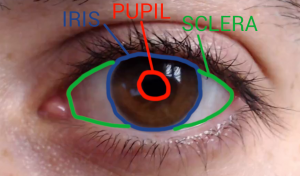

# Eye Motion Detection

#### The eye is composed of three main parts:

1. Pupil – the black circle in the middle
2. Iris – the bigger circle that can have different color for different people
3. Sclera – it’s always white

It is based on [Eye motion detection using openCV](https://pysource.com/2019/01/04/eye-motion-tracking-opencv-with-python/)
